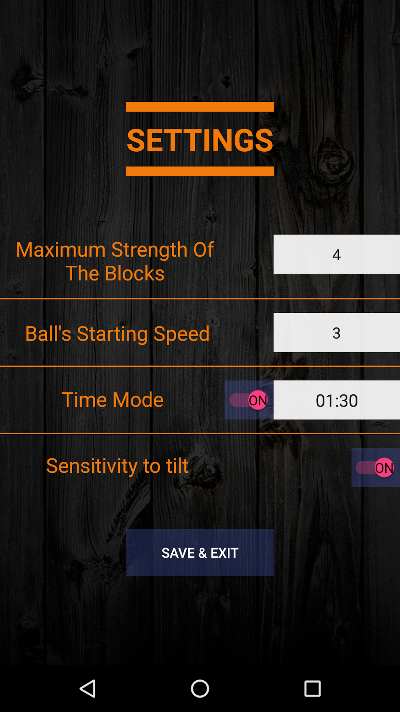

# Bricks Breaker
> Командный проект в рамках летней школьной практики в компании JetBrains

### Команда:
- Евгений Абрамов ([@evgenabramov](https://github.com/evgenabramov))
- Вадим Ланько ([@buzka16](https://github.com/buzka16))
- Андрей Тагиев 
- Сергей Петров

### Описание:
На экране игры имеются:
- поле с прямоугольными блоками
- доска внизу поля, перемещаемая пользователем по горизонтали
- шарик, перемещающийся по части поля между блоками и доской, который позволяет разрушать блоки
  
**Задача**: *разрушить все блоки на поле, перемещая по экрану доску*

**Сложность**: если шарик внизу экрана не попадает на доску, пользователь проигрывает и может начать игру заново

**Настраиваемые элементы**:
- Регулировка сложности за счет 
  - увеличения скорости шарика 
  - изменения прочности блоков

[Презентация проекта](BricksBreaker.pdf)

### Некоторые скриншоты игры:
Стартовый экран             |  Экран настроек         | Игровое поле 
:-------------------------:|:-------------------------:|:-----------------:
 |  | 
